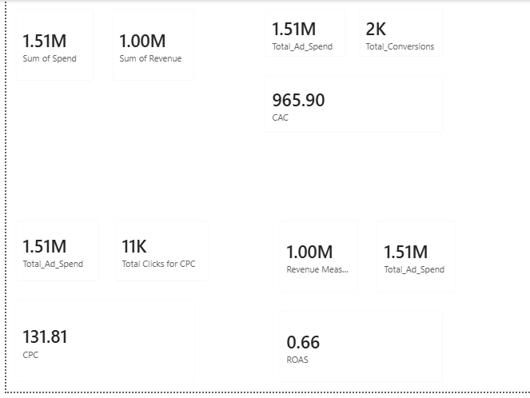
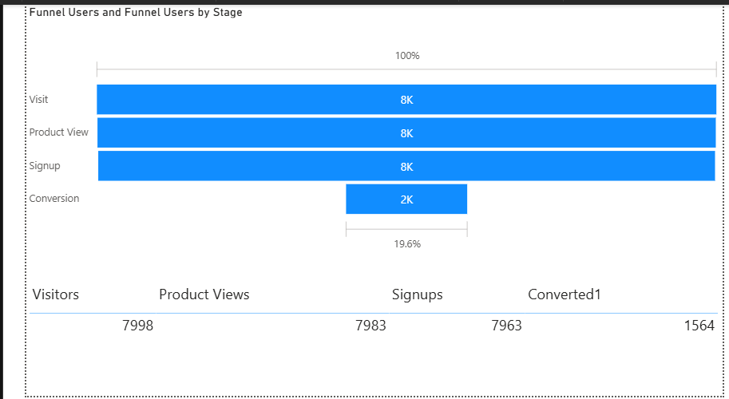
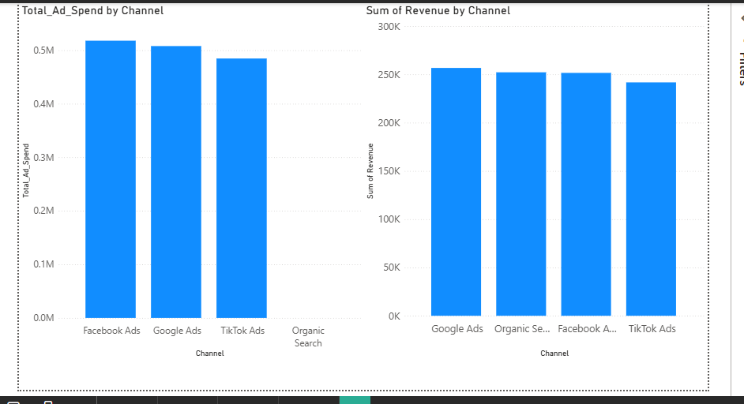
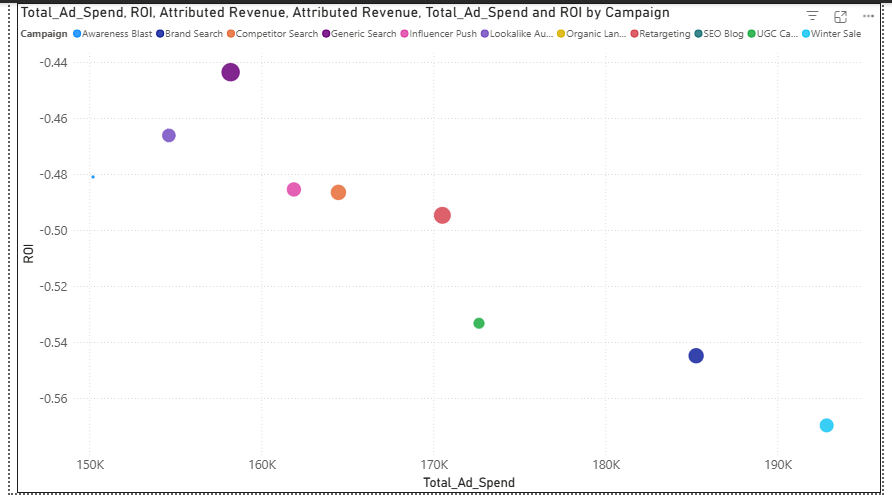
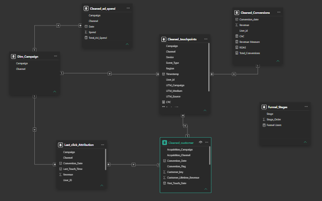

# 📊 Multi-Touch Marketing Attribution & ROI Dashboard

> A complete end-to-end analytics project that replaces misleading Last-Click attribution with First-Touch, Last-Touch, and Linear models — revealing the true return on every advertising dollar spent across Google Ads, Facebook Ads, TikTok Ads, and Organic Search.


---

## 📌 Table of Contents

- [Project Overview](#-project-overview)
- [Business Problem](#-business-problem)
- [Project Objectives](#-project-objectives)
- [Dashboard KPIs](#-dashboard-kpis)
- [Conversion Funnel Analysis](#-conversion-funnel-analysis)
- [Channel Performance](#-channel-performance)
- [Campaign ROI Analysis](#-campaign-roi-analysis)
- [Attribution Models](#-attribution-models)
- [Data Model](#-data-model)
- [Dataset Overview](#-dataset-overview)
- [Tools & Technologies](#️-tools--technologies)
- [SQL Scripts](#-sql-scripts)
- [Python Notebooks](#-python-notebooks)
- [Business Insights & Marketing Recommendations](#-business-insights--marketing-recommendations)
- [Repository Structure](#-repository-structure)
- [Getting Started](#-getting-started)
- [Team](#-team)

---

## 🧭 Project Overview

E-commerce and SaaS companies invest heavily across multiple advertising channels — Google Ads, Facebook Ads, TikTok Ads, LinkedIn — yet most teams still rely on **Last-Click attribution**: a model that gives 100% of the credit for a sale to whichever channel the customer clicked last.

This completely ignores the earlier touchpoints that initially built awareness and nurtured the customer toward that final decision. The result? Marketing budgets get reallocated away from channels that are actually working, and toward channels that simply happen to appear last in the journey.

This project solves that problem.

It ingests fragmented data from three sources — **advertising spend records, website event logs, and CRM conversion data** — cleans and models everything into a structured data warehouse, and applies three industry-standard attribution models to fairly distribute conversion credit across every customer touchpoint. The final output is an interactive **Power BI dashboard** that gives marketing leaders a truthful, model-driven picture of channel and campaign performance.

---

## 🎯 Business Problem

A customer's journey to purchase is rarely a single step. For example:

1. A user sees a **Facebook Ad** on Monday → builds awareness
2. They read an **Organic blog post** on Wednesday → considers the product
3. They click a **Google Search Ad** on Friday → converts

Under Last-Click attribution, **Google gets 100% of the credit** and Facebook gets nothing. Marketing teams see this data, cut Facebook's budget, and unknowingly destroy the awareness pipeline that feeds every other channel.

**This project answers the real question:** *Which channels and campaigns are actually contributing to revenue across the entire customer journey?*

---

## 📋 Project Objectives

- Consolidate ad spend, web traffic, and conversion data into one unified analytical model
- Sequence each customer's journey chronologically across all touchpoints
- Implement **First-Touch, Last-Touch, and Linear** attribution models
- Calculate key marketing KPIs: **ROAS, CAC, CPC, and Total Conversions**
- Build an interactive dashboard that allows marketing teams to toggle between attribution models
- Deliver actionable budget reallocation recommendations based on true channel performance

---

## 📈 Dashboard KPIs

> *The following figures are sourced directly from the completed Power BI dashboard.*

| KPI | Value |
|---|---|
| **Total Ad Spend** | $1.51M |
| **Total Revenue** | $1.00M |
| **ROAS (Return on Ad Spend)** | 0.66 |
| **CAC (Customer Acquisition Cost)** | $965.90 |
| **CPC (Cost Per Click)** | $131.81 |
| **Total Conversions** | 2,000 (1,564 confirmed) |
| **Total Clicks** | 11K |

> ⚠️ A ROAS of 0.66 means that for every $1.00 spent on advertising, only $0.66 in revenue is returned. All campaigns are currently loss-making, making optimization an urgent business priority.



---

## 🔽 Conversion Funnel Analysis

The funnel tracks users from their first website visit through to a completed purchase.

| Stage | Users | Drop-off |
|---|---|---|
| **Visitors** | 7,998 | — |
| **Product Views** | 7,983 | 0.2% |
| **Signups** | 7,963 | 0.2% |
| **Conversions** | 1,564 | **80.4%** |

**Key Finding:** The funnel is nearly lossless through the top three stages — almost every visitor views a product and signs up. However, there is an **80.4% drop-off at the final conversion stage** (Signup → Purchase). This is where the business is losing customers, and it points to a checkout, pricing, or trust issue rather than a traffic or awareness problem.



---

## 📊 Channel Performance

### Ad Spend by Channel

| Channel | Total Ad Spend |
|---|---|
| Facebook Ads | ~$530K (Highest) |
| Google Ads | ~$520K |
| TikTok Ads | ~$480K |
| Organic Search | ~$0 (No paid cost) |

### Revenue Generated by Channel

| Channel | Revenue Generated |
|---|---|
| Google Ads | ~$260K (Highest) |
| Organic Search | ~$252K |
| Facebook Ads | ~$250K |
| TikTok Ads | ~$240K (Lowest) |

**Key Finding:** Organic Search generates the second-highest revenue with virtually zero advertising spend — making it the most cost-efficient channel by a significant margin. Facebook Ads has the highest spend but does not lead in revenue, suggesting budget inefficiency.



---

## 🎯 Campaign ROI Analysis

All 11 campaigns currently show a negative ROI, meaning total spend exceeds revenue generated. However, the spread is meaningful — some campaigns are significantly less loss-making than others.

| Campaign | Approx. Total Spend | ROI (Approx.) | Relative Performance |
|---|---|---|---|
| **Generic Search** | ~$158K | **-0.44** | ✅ Best |
| **Brand Search** | ~$155K | ~-0.46 | ✅ 2nd Best |
| **Awareness Blast** | ~$148K | ~-0.48 | Good |
| **Competitor Search** | ~$161K | ~-0.49 | Average |
| **Influencer Push** | ~$164K | ~-0.49 | Average |
| **Lookalike Audience** | ~$163K | ~-0.50 | Below Average |
| **Retargeting** | ~$168K | ~-0.50 | Below Average |
| **UGC Campaign** | ~$165K | ~-0.52 | Poor |
| **SEO Blog** | ~$172K | ~-0.53 | Poor |
| **Winter Sale** | **~$192K** | **~-0.57** | ❌ Worst |

**Key Finding:** Generic Search is the best-performing campaign despite not being the highest spender. Winter Sale is the worst — it carries the highest spend of all campaigns and produces the weakest ROI.



---

## 🔀 Attribution Models

This project implements three standard attribution models, all accessible as toggles in the Power BI dashboard.

### 1. First-Touch Attribution
Assigns 100% of the conversion credit to the very first channel or campaign that a customer interacted with. Useful for measuring which channels are most effective at building initial awareness and driving new users into the funnel.

### 2. Last-Touch Attribution
Assigns 100% of the conversion credit to the final channel or campaign the customer interacted with before converting. This is the traditional model used by most analytics platforms — and the one this project is designed to challenge.

### 3. Linear Attribution
Distributes conversion credit equally across every touchpoint in the customer's journey. If a customer had 4 interactions before converting, each touchpoint receives 25% of the credit. This model treats every stage of the funnel as equally important.

> **Why this matters:** Switching between models changes which channels appear most valuable. A channel that looks weak under Last-Touch may reveal itself as the primary awareness driver under First-Touch. The dashboard lets marketing teams see all three views simultaneously and make budget decisions based on the complete picture.

---

## 🗂️ Data Model

The project uses a **Star Schema** — the industry standard for Business Intelligence — with one central fact table surrounded by descriptive dimension tables. This design enables fast aggregation and clean relationships across all datasets.

**Tables in the model:**

| Table | Type | Description |
|---|---|---|
| `Cleaned_touchpoints` | Fact (Central) | Every individual customer interaction/event — the core grain of the model |
| `Cleaned_ad_spend` | Fact | Daily spend records per channel and campaign |
| `Cleaned_Conversions` | Fact | Revenue and conversion date per customer |
| `Cleaned_customer` | Dimension | Customer attributes — region, device, acquisition channel, total touchpoints |
| `Dim_Campaign` | Dimension | Campaign and channel reference table |
| `fact_last_click_attribution` | Derived Fact | Pre-calculated last-click attribution result table |
| `Funnel_Stages` | Dimension | Stage labels and ordering for the conversion funnel visual |



---

## 🗃️ Dataset Overview

| Dataset | Key Columns | Records |
|---|---|---|
| `Cleaned_ad_spend.csv` | date, channel, campaign, spend | Daily spend records across 4 channels, 11 campaigns |
| `Cleaned_Conversions.csv` | user_id, conversion_date, revenue | One row per converted user |
| `Cleaned_customer.csv` | user_id, region, device, total_touchpoints, conversion_flag, acquisition_channel | One row per user |
| `Cleaned_touchpoints.csv` | user_id, timestamp, channel, campaign, event_type, utm_source, utm_medium | One row per touchpoint/event |

**Channels covered:** Google Ads, Facebook Ads, TikTok Ads, Organic Search  
**Campaigns covered:** Generic Search, Brand Search, Awareness Blast, Competitor Search, Influencer Push, Lookalike Audience, Retargeting, UGC Campaign, SEO Blog, Organic Landing, Winter Sale  
**Regions covered:** North America, Asia Pacific (and others)  
**Devices tracked:** Desktop, Mobile, Tablet

---

## 🛠️ Tools & Technologies

| Category | Tools |
|---|---|
| **Data Cleaning & EDA** | Python, Pandas, NumPy, Matplotlib, Seaborn, Jupyter Notebooks |
| **Database & Attribution Logic** | MySQL, SQL (CTEs, Window Functions, Joins) |
| **Business Intelligence** | Power BI, DAX |
| **Version Control** | Git, GitHub |
| **Development Environment** | VS Code |

---

## 🗄️ SQL Scripts

All SQL scripts are available in the `/SQL` folder of this repository.

| Script | Purpose |
|---|---|
| [01_Creating_ad_spend.sql](https://github.com/MarySabestine/Multi-Touch-Marketing-Attribution-ROI-Dashboard/blob/05725ff76d237a985e37ce0e37ca9fdf29790454/SQL/01_Creating_ad_spend.sql) | Creates the ad spend table |
| [01_creating_conversions.sql](https://github.com/MarySabestine/Multi-Touch-Marketing-Attribution-ROI-Dashboard/blob/05725ff76d237a985e37ce0e37ca9fdf29790454/SQL/01_creating_conversions.sql) | Creates the conversions table |
| [01_Creating_customer.sql](https://github.com/MarySabestine/Multi-Touch-Marketing-Attribution-ROI-Dashboard/blob/05725ff76d237a985e37ce0e37ca9fdf29790454/SQL/01_Creating_customer.sql) | Creates the customer dimension table |
| [01_Creating_touchpoints.sql](https://github.com/MarySabestine/Multi-Touch-Marketing-Attribution-ROI-Dashboard/blob/05725ff76d237a985e37ce0e37ca9fdf29790454/SQL/01_Creating_touchpoints.sql) | Creates the touchpoints fact table |
| [02_User_Journey.sql](https://github.com/MarySabestine/Multi-Touch-Marketing-Attribution-ROI-Dashboard/blob/05725ff76d237a985e37ce0e37ca9fdf29790454/SQL/02_User_Journey.sql) | Sequences each user's touchpoints chronologically using window functions |
| [03_Total_Spend_by_Channel_Campaign.sql](https://github.com/MarySabestine/Multi-Touch-Marketing-Attribution-ROI-Dashboard/blob/05725ff76d237a985e37ce0e37ca9fdf29790454/SQL/03_Total_Spend_by_Channel_Campaign.sql) | Aggregates ad spend by channel and campaign |
| [03_Total_Spend_By_Channel.sql](https://github.com/MarySabestine/Multi-Touch-Marketing-Attribution-ROI-Dashboard/blob/05725ff76d237a985e37ce0e37ca9fdf29790454/SQL/03_Total_Spend_By_Channel.sql) | Aggregates ad spend by channel only |
| [04_CAC.sql](https://github.com/MarySabestine/Multi-Touch-Marketing-Attribution-ROI-Dashboard/blob/05725ff76d237a985e37ce0e37ca9fdf29790454/SQL/04_CAC.sql) | Calculates Customer Acquisition Cost |
| [04_CPC_per_Channel.sql](https://github.com/MarySabestine/Multi-Touch-Marketing-Attribution-ROI-Dashboard/blob/05725ff76d237a985e37ce0e37ca9fdf29790454/SQL/04_CPC_per_Channel.sql) | Calculates Cost Per Click per channel |
| [04_ROAS.sql](https://github.com/MarySabestine/Multi-Touch-Marketing-Attribution-ROI-Dashboard/blob/05725ff76d237a985e37ce0e37ca9fdf29790454/SQL/04_ROAS.sql) | Calculates Return on Ad Spend using CTEs |
| [05_First_click_Attribution.sql](https://github.com/MarySabestine/Multi-Touch-Marketing-Attribution-ROI-Dashboard/blob/05725ff76d237a985e37ce0e37ca9fdf29790454/SQL/05_First_click_Attribution.sql) | Implements First-Click attribution weight logic |

---

## 🐍 Python Notebooks

All data cleaning and transformation was carried out in Jupyter Notebooks, one per dataset.

| Notebook | Dataset Cleaned |
|---|---|
| [Transforming-ad_Spend.ipynb](https://github.com/MarySabestine/Multi-Touch-Marketing-Attribution-ROI-Dashboard/blob/05725ff76d237a985e37ce0e37ca9fdf29790454/Python%20Notebooks/Transforming-ad_Spend.ipynb) | Ad Spend data |
| [Transforming-Conversions.ipynb](https://github.com/MarySabestine/Multi-Touch-Marketing-Attribution-ROI-Dashboard/blob/05725ff76d237a985e37ce0e37ca9fdf29790454/Python%20Notebooks/Transforming-Conversions.ipynb) | Conversions / CRM data |
| [Transforming-Customer.ipynb](https://github.com/MarySabestine/Multi-Touch-Marketing-Attribution-ROI-Dashboard/blob/05725ff76d237a985e37ce0e37ca9fdf29790454/Python%20Notebooks/Transforming-Customer.ipynb) | Customer dimension data |
| [Transforming-user_touchpoints.ipynb](https://github.com/MarySabestine/Multi-Touch-Marketing-Attribution-ROI-Dashboard/blob/05725ff76d237a985e37ce0e37ca9fdf29790454/Python%20Notebooks/Transforming-user_touchpoints.ipynb) | Web event / touchpoints data |

**Cleaning steps performed across notebooks:**
- Handled missing UTM parameters and campaign tracking strings
- Standardized timestamp formats across timezone-inconsistent log sources
- Deduplicated user IDs and session records
- Resolved structural inconsistencies in raw event logs
- Validated and enforced consistent channel/campaign naming conventions

---

## 💡 Business Insights & Marketing Recommendations

### Insight 1 — ROAS Below Break-Even (0.66)
Every campaign is operating at a loss. For every $1 spent, only $0.66 is returned. This is a portfolio-wide signal that the current channel mix and campaign strategies require fundamental review before spend is increased further.

**Recommendation:** Freeze budget growth across all channels. Conduct a full audit of landing pages, ad creatives, and targeting parameters before committing to the next spend cycle. Prioritize ROAS > 1.0 as the minimum threshold for any channel before scaling.

---

### Insight 2 — Conversion Bottleneck at Final Funnel Stage
While 7,998 users enter the funnel and 7,963 successfully sign up (a near-perfect 99.6% retention rate across the top three stages), only 1,564 of those signups ultimately convert — a drop of **80.4%**. The problem is not traffic or awareness. The product is reaching and engaging users effectively. The barrier is at the point of purchase.

**Recommendation:** Investigate and optimize the checkout experience. A/B test pricing presentation, simplify the conversion flow, introduce trust signals (reviews, guarantees), and implement cart abandonment email sequences targeting the 6,399 users who signed up but did not convert.

---

### Insight 3 — Generic Search Delivers the Best ROI
Despite not being the highest-spending campaign, Generic Search consistently delivers the closest-to-positive ROI (~-0.44) and should be treated as the best-performing paid campaign in the portfolio.

**Recommendation:** Reallocate budget toward Generic Search. Expand keyword targeting, increase daily bid caps, and run head-to-head creative tests to identify which ad formats within this campaign drive the strongest conversion intent.

---

### Insight 4 — Winter Sale is the Biggest Budget Drain
Winter Sale carries the highest spend (~$192K) of any campaign and produces the worst ROI (~-0.57). It is both the most expensive and least effective campaign.

**Recommendation:** Pause the Winter Sale campaign immediately and redirect its budget to Generic Search and Brand Search. If seasonal campaigns are a business requirement, rebuild the strategy with tighter audience targeting and a defined minimum ROAS threshold before scaling spend.

---

### Insight 5 — Organic Search is Underinvested
Organic Search generates ~$252K in revenue with near-zero paid cost, making it the highest-ROI channel in the entire portfolio. Yet it appears to receive the least strategic attention.

**Recommendation:** Invest in SEO and content marketing immediately. Every dollar spent on organic search strategy (content creation, on-page optimization, link building) returns value that compounds over time — unlike paid channels which stop delivering the moment spend pauses. A modest SEO investment could significantly reduce overall CAC.

---

### Insight 6 — CAC of $965.90 is Unsustainable
At $965.90 per acquired customer and an average revenue of ~$640 per conversion, the business is losing money on every customer it acquires. The lifetime value of a customer must exceed the acquisition cost for the model to be viable.

**Recommendation:** Calculate Customer Lifetime Value (CLV) and compare it against CAC. If CLV < CAC, introduce post-purchase retention strategies (loyalty programs, upselling, subscription models) to increase revenue per customer before continuing to invest in acquisition.

---

## 📁 Repository Structure

```
Multi-Touch-Marketing-Attribution-ROI-Dashboard/
│
├── Python Notebooks/
│   ├── Transforming-ad_Spend.ipynb
│   ├── Transforming-Conversions.ipynb
│   ├── Transforming-Customer.ipynb
│   └── Transforming-user_touchpoints.ipynb
│
├── SQL/
│   ├── 01_Creating_ad_spend.sql
│   ├── 01_creating_conversions.sql
│   ├── 01_Creating_customer.sql
│   ├── 01_Creating_touchpoints.sql
│   ├── 02_User_Journey.sql
│   ├── 03_Total_Spend_by_Channel_Campaign.sql
│   ├── 03_Total_Spend_By_Channel.sql
│   ├── 04_CAC.sql
│   ├── 04_CPC_per_Channel.sql
│   ├── 04_ROAS.sql
│   └── 05_First_click_Attribution.sql
│
├── Dataset/
│   └──Cleaned Data
│      └──Cleaned_ad_spend.csv
│      └──Cleaned_Conversions.csv
│      └──Cleaned_customer.csv
│      └──Cleaned_touchpoints.csv
│      └──Last_click_Attribution.csv
│   └──Raw Data
│      └──ad_spend.csv.xls
│      └──conversions.csv.xls
│      └──dim_customer.csv.xls
│      └──user_touchpoints.csv.xls
│
├── PowerBI/
│   └── Marketing_Attribution.pbix
│   └── Marketing_Attribution.pdf
│
├── Images/
│   ├── KPI_s.png
│   ├── Conversion_Funnel.png
│   ├── Channel_Comparision.png
│   ├── ROI_Scatter_Plot.png
│   └── Data_Model.png
│
└── README.md
```

---

## 🚀 Getting Started

### Prerequisites
- Python 3.8+
- MySQL or SQLite
- Power BI Desktop (free download from Microsoft)
- Jupyter Notebook

### Setup

```bash
# Clone the repository
git clone https://github.com/MarySabestine/Multi-Touch-Marketing-Attribution-ROI-Dashboard.git
cd Multi-Touch-Marketing-Attribution-ROI-Dashboard

# Install Python dependencies
pip install pandas numpy matplotlib seaborn jupyter

# Run the cleaning notebooks (in order)
jupyter notebook "Python Notebooks/Transforming-ad_Spend.ipynb"
jupyter notebook "Python Notebooks/Transforming-Conversions.ipynb"
jupyter notebook "Python Notebooks/Transforming-Customer.ipynb"
jupyter notebook "Python Notebooks/Transforming-user_touchpoints.ipynb"
```

Then load the cleaned CSVs into your MySQL database and run the SQL scripts in order (01 → 02 → 03 → 04 → 05).

Finally, open `Dashboard/Marketing_Attribution.pbix` in Power BI Desktop and refresh the data source connection.

---

## 👥 Team

This project was built collaboratively by a team of 3.

---

**Member 1**

> 📛 Name: *Anil Kumar Pyarasani*
> 💼 LinkedIn: *https://www.linkedin.com/in/pyarasani-anil-kumar/*
> 🐙 GitHub: *https://github.com/Anilqumr/*
> 📧 Email: *Anilqumr@gmail.com*

---

**Member 2**

> 📛 Name: *Nneka Akanno*
> 💼 LinkedIn: *https://www.linkedin.com/in/nneka-akanno/*
> 🐙 GitHub: *https://github.com/MarySabestine*
> 📧 Email: *akannomary@gmail.com*

---

**Member 3**

> 📛 Name: *Anshuman Satpute*
> 💼 LinkedIn: *https://www.linkedin.com/in/anshuman-satpute-0ab978313*
> 🐙 GitHub: *https://github.com/02Anshuman*
> 📧 Email: *anshumansatpute2002@gmail.com*

---
Member | Professional Profiles |
| :--- | :--- |
| **Anil Kumar Pyarasani** | [💼 LinkedIn](https://www.linkedin.com/in/pyarasani-anil-kumar/) \| [🐙 GitHub](https://github.com/Anilqumr/) \| [✉️ Email](mailto:Anilqumr@gmail.com) |
| **Nneka Akanno** | [💼 LinkedIn](https://www.linkedin.com/in/nneka-akanno/) \| [🐙 GitHub](https://github.com/MarySabestine) \| [✉️ Email](mailto:akannomary@gmail.com) |
| **Anshuman Satpute** | [💼 LinkedIn](https://www.linkedin.com/in/anshuman-satpute-0ab978313) \| [🐙 GitHub](https://github.com/02Anshuman) \| [✉️ Email](mailto:anshumansatpute2002@gmail.com) |
---

⭐ *If you found this project useful or insightful, consider giving it a star on GitHub!*